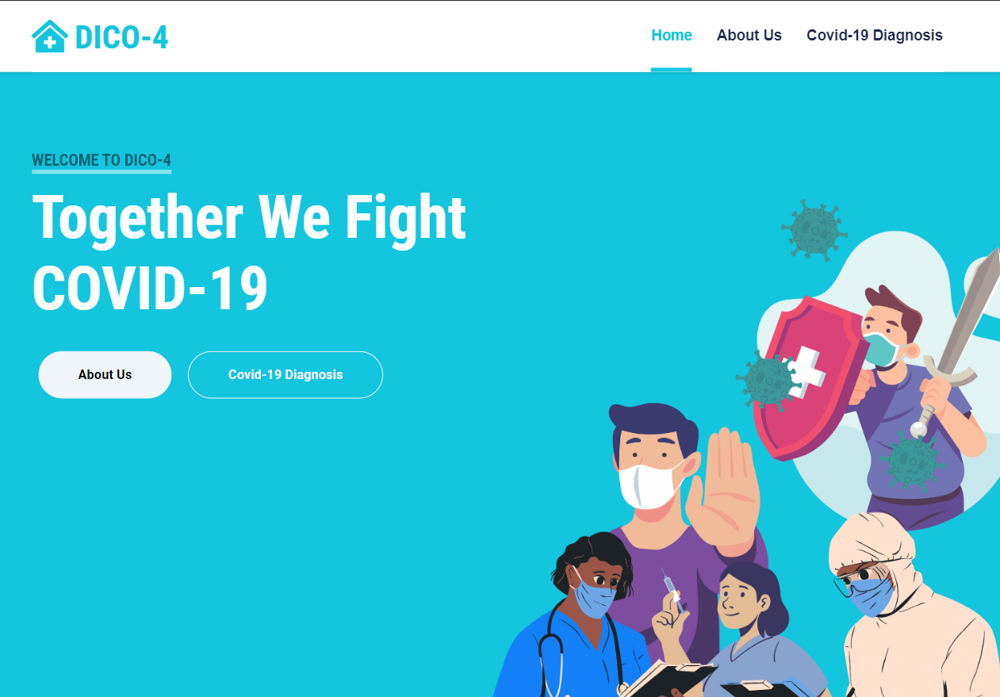

# DICO-4

Welcome to Dico-4, a web application that helps users diagnose whether they may have COVID-19 based on their symptoms and medical history. The application also checks for other common diseases that may have similar symptoms to COVID-19. Dico-4 is built using PHP, SQL, HTML, and CSS.

🌐 Website: [**DICO-4**](https://dico-4.000webhostapp.com)

Dico-4 is a group project developed as a final task for a course. It was created by a team of developers with the same major. The aim of Dico-4 is to provide a convenient and accessible tool for users to assess their likelihood of having COVID-19 based on their symptoms and medical history.

## Features

- **Symptom-based Diagnosis**: Users are presented with a series of questions about their symptoms and medical history to assess their likelihood of having COVID-19. The application uses a set of rules and algorithms to analyze the user's responses.

- **Check for Similar Disea**ses: In addition to COVID-19, Dico-4 checks for other common diseases that may have similar symptoms, such as the flu, allergies, and strep throat. This provides a more comprehensive assessment of the user's condition.

- **Summary of Diagnosis: A**fter completing the questionnaire, users receive a summary of their diagnosis. This includes the likelihood of having COVID-19 and other potential diseases based on their responses.

- **Recommendations and Nex**t Steps: Based on the diagnosis, Dico-4 provides recommendations on what the user should do next. This can include seeking medical advice, self-isolating, or monitoring symptoms closely.

- **Persistent User Data: T**he user's responses are stored in a MySQL database, allowing for the tracking of COVID-19 cases and other diseases. This data can provide valuable insights for public health purposes.

## Technologies Used
Dico-4 is built using the following technologies:

- [**PHP**](https://www.w3schools.com/php): PHP (Hypertext Preprocessor) is used for the server-side logic of the application. It handles the processing of user responses, diagnosis generation, and database interactions.

- [**SQL**](https://www.w3schools.com/sql/sql_intro.asp): Structured Query Language (SQL) is used to manage the database of symptoms, diseases, and user responses. It allows for efficient storage and retrieval of data.

- [**HTML**](https://html.com)L: HTML (Hypertext Markup Language) is used for the structure and layout of the web pages in Dico-4. It provides the foundation for displaying content and user interfaces.

- [**CSS**](https://www.w3schools.com/css): Cascading Style Sheets (CSS) is used to enhance the visual appearance of Dico-4. CSS styles are applied to HTML elements to create an appealing and user-friendly interface.

## 🔗 Links

   

